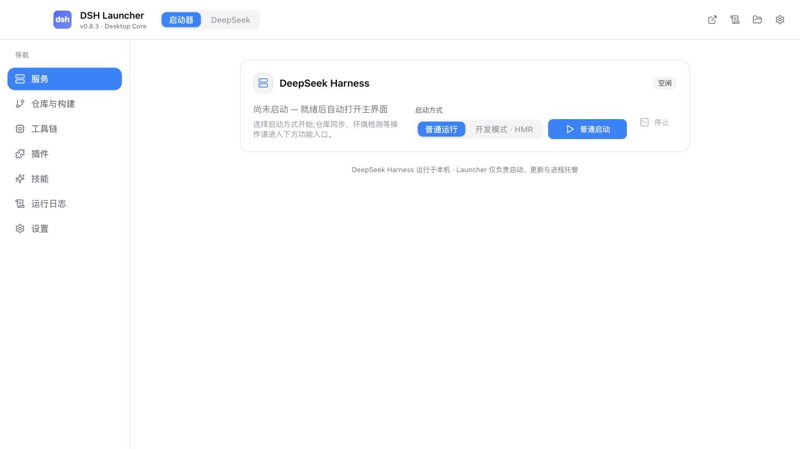
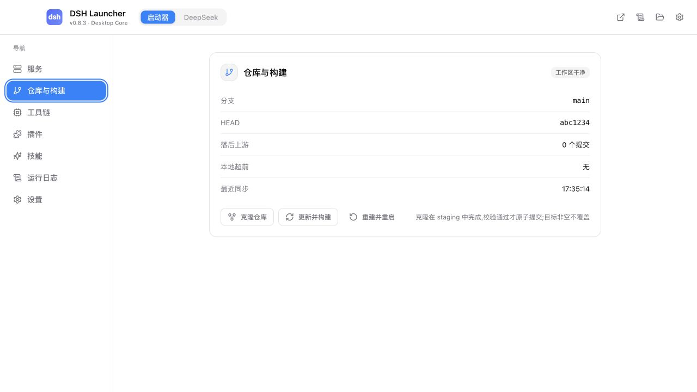
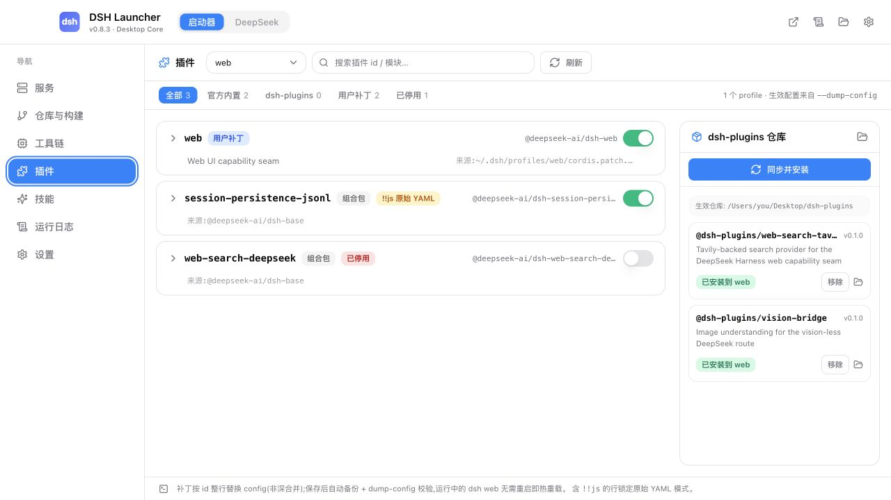

<div align="center">


# DSH Launcher

**让 DeepSeek Harness 从“能跑”变成“随时可用”。**

一个为 [DeepSeek Harness](https://github.com/deepseek-ai/deepseek-harness) 打造的原生桌面启动器：
把仓库、工具链、构建、服务、插件、技能和日志，收进一个清爽的工作台。

<p>
  <a href="https://github.com/Yoahoug/dsh-launcher/releases"></a>
  <a href="https://github.com/Yoahoug/dsh-launcher/actions"></a>
  <a href="https://github.com/Yoahoug/dsh-launcher/blob/main/LICENSE"></a>
  
  
</p>

[下载最新版本](https://github.com/Yoahoug/dsh-launcher/releases) · [提交 Issue](https://github.com/Yoahoug/dsh-launcher/issues) · [查看开发计划](./docs/development-plan.md)

</div>

---

## 它解决什么问题？

DeepSeek Harness 很强，但源码项目的日常使用往往不止是执行一次 `pnpm run build`：要记住仓库在哪里、Node 版本是否匹配、依赖有没有更新、服务是否真的启动、插件配置有没有写坏，以及退出后有没有留下后台进程。

DSH Launcher 把这些琐碎但重要的步骤串成一条清晰的路径：

> **选好仓库 → 检查环境 → 启动或开发 → 直接进入 DeepSeek → 需要时更新、构建、回滚和查看日志。**

它不是另一个 Node daemon，也不接管 DeepSeek Harness 的业务逻辑。Launcher 负责桌面体验和生命周期管理，`dsh web` 仍然运行在你的本机、使用你自己的仓库与配置。

## 你会得到什么

| 场景 | Launcher 会帮你做什么 |
| --- | --- |
| 第一次使用 | 没有可用仓库时进入引导；可以选择已有目录，也可以直接克隆 DeepSeek Harness |
| 日常启动 | 自动判断是否需要构建，等待服务真正就绪后再进入 DeepSeek 工作区 |
| 本地开发 | 一键启动 dsh web 与前端 HMR，修改源码后无需反复手动刷新 |
| 代码更新 | `git pull --rebase --autostash`，仅在 lockfile 变化时安装依赖，再构建并重启 |
| 环境不完整 | 检查 Node、pnpm、Git、仓库和构建产物；缺什么可以在工具链页面处理 |
| 插件配置 | 查看插件来源层，使用表单或原始 YAML 修改，保存前备份，校验失败自动回滚 |
| 技能管理 | 新建、编辑、导入技能；扫描 Codex、Claude Code、Cursor、OpenCode、Agents 等外部技能目录 |
| 长期运行 | 关闭窗口可缩到托盘，重启 Launcher 可召回仍在运行的 dsh web，重复启动不会重复拉起服务 |
| 出问题时 | 实时日志、阶段状态、健康检查和可读诊断都集中在应用内 |

## 界面预览

启动器首页把当前服务状态、启动方式和下一步操作放在同一张卡片里；左侧导航则把仓库、工具链、插件、技能、日志和设置分开，避免把复杂配置堆在启动按钮旁边。

<p align="center">
  
</p>

<p align="center"><sub>服务首页 · 浏览器预览使用 mock 数据，桌面版会连接真实 Rust 核心。</sub></p>

<p align="center">
  
  
</p>

<p align="center"><sub>仓库与构建 · 插件管理</sub></p>

### 一个窗口里的两个工作区

启动器和 DeepSeek 工作区共用同一个原生窗口。切换到 DeepSeek 后，页面由独立的零权限子 WebView 承载，不使用 iframe，也不会把 Tauri IPC、桌面密钥或本地状态暴露给页面。

返回启动器只是隐藏工作区，不会销毁页面，因此登录状态、会话和页面位置都能保留；服务重启后，工作区会显示断线状态并自动尝试重连。

## 快速开始

### 方式一：下载桌面版

从 [Releases](https://github.com/Yoahoug/dsh-launcher/releases) 下载对应平台的安装包：

- **macOS Apple Silicon**：下载 `dsh-launcher_<版本>_aarch64.dmg`，打开后将应用拖入“应用程序”。
- **Windows 10/11 x64**：下载 `dsh-launcher_<版本>_x64-setup.exe`。默认按当前用户安装，不需要管理员权限。
- **Windows 绿色版**：解压 `win-x64-portable.zip` 后运行 `dsh-launcher.exe`，适合测试和临时使用。

首次启动如果没有找到合适的 Node.js，打开「工具链」即可安装 Launcher 托管的 Node 24 LTS 与 pnpm。dsh 当前要求 Node `^22.19.0 || >=24.0.0`。

未配置开发者签名时，系统可能提示“未知开发者”：

- macOS：在 Finder 中右键应用，选择“打开”。
- Windows：点击“更多信息” → “仍要运行”。

### 方式二：从源码运行

#### 1. 准备环境

- Node.js `^22.19.0 || >=24.0.0`
- pnpm `11.x`
- Rust stable、`rustup`
- Git

Node 和 pnpm 用于前端与 DeepSeek Harness 工程；Rust 工具链用于编译 Tauri 桌面核心。

#### 2. 安装并启动桌面开发版

```bash
git clone https://github.com/Yoahoug/dsh-launcher.git
cd dsh-launcher
pnpm install
pnpm dev:desktop
```

`pnpm dev:desktop` 会同时启动 Vite 渲染器和 Tauri 原生核心。应用窗口打开后，按首次运行向导选择或克隆 DeepSeek Harness 仓库即可。

仓库内置 `.npmrc`，默认使用 `registry.npmmirror.com` 并对网络重置自动重试；如果你的网络环境已经配置了其他 registry，也可以按本机习惯调整。

#### 3. 只预览前端界面

如果当前只想查看 React 界面，不需要编译 Rust 桌面壳：

```bash
pnpm dev:renderer
```

然后打开 [http://localhost:1420](http://localhost:1420)。浏览器预览会使用内置 mock 数据，适合查看页面布局、主题和交互；真正的仓库操作、进程托管、托盘和子 WebView 需要通过 Tauri 桌面版运行。

## 第一次启动怎么走

1. 在「仓库与构建」中选择已有的 DeepSeek Harness git 仓库，或点击「克隆仓库」。
2. 在「工具链」查看 Node、pnpm、Git、仓库和构建产物是否正常。
3. 回到「服务」，选择普通启动或开发模式。
4. Launcher 会在必要时自动构建，并依次确认进程、端口、健康检查和页面就绪状态。
5. 只有所有检查通过后才会进入 DeepSeek 工作区；失败、取消和超时不会被误报成成功。

克隆时选择的是“放置位置”，Launcher 会在该目录下创建仓库目录。目标目录已有内容时不会覆盖；克隆失败或取消只清理本次 staging 内容。

## 功能地图

### 服务

- 普通启动：运行本地 `dsh web`。
- 开发模式：同时运行 `dsh web` 与 `pnpm run dev:web`，支持 HMR。
- 重建并重启：停止旧服务、重新构建，再通过就绪检查后进入工作区。
- 停止服务：按进程组停止，必要时再强制结束，避免残留子进程。

### 仓库与构建

- 显示当前分支、HEAD、领先/落后提交数和最近同步状态。
- 支持克隆、更新并构建、重建并重启。
- 更新采用 `git pull --rebase --autostash`；遇到冲突只报告，不执行 `reset --hard`。
- lockfile 未变化时不会无意义地重新安装依赖。

### 工具链

- 检查当前实际生效的 Node、pnpm、Git 版本、来源和路径。
- 自动判断 dsh 的 Node 版本约束。
- 可选安装托管 Node 24 LTS、pnpm；Windows 还支持托管 MinGit。
- 托管组件下载后进行长度与 SHA-256 校验，安装在应用数据目录的版本化路径，不修改系统 PATH、全局 npm 或 Git 配置。

### 插件与技能

- 插件按组合包、profile patch、home patch、overlay 等来源层展示。
- 支持启停、表单化配置和原始 YAML 高级编辑。
- 写入插件配置前自动备份，随后运行 `dsh --profile <profile> --dump-config` 校验；失败自动回滚。
- 可联动本地或 GitHub 上的 `dsh-plugins` 仓库，构建、安装和移除插件包。
- 技能支持创建、修改、删除、导入和正文预览。
- 自动发现常见 AI 工具的技能目录；“一键启用”会把外部技能根接入 `skill-filesystem.customSkillDirs`，运行中的 dsh 可通过 HMR 感知变化。

### 托盘、日志与更新

- 关闭窗口默认隐藏到托盘，dsh web 继续运行。
- 托盘菜单展示当前状态；点击图标可召回窗口。
- 重启 Launcher 时会通过进程存活、命令行和端口三重校验召回现有服务。
- 托盘退出会先停止 dsh 进程树，再退出 Launcher。
- 日志实时推送、按来源区分，并落盘到本地状态目录。
- 安装版支持基于 minisign 签名的 Tauri updater，可在「设置 → 更新」手动检查，也可以启动时自动检查。

## 常用命令

| 命令 | 用途 |
| --- | --- |
| `pnpm dev:desktop` | 启动 Tauri 桌面开发版 |
| `pnpm dev:renderer` | 只启动 Vite 前端预览 |
| `pnpm build:renderer` | 构建 React 渲染器 |
| `pnpm typecheck` | TypeScript 类型检查 |
| `pnpm test:ui` | 运行 UI 单元测试 |
| `pnpm build:desktop` | 构建桌面安装包 |
| `node scripts/verify-desktop.mjs` | 串行执行前端、Rust 与桌面构建门禁 |

Rust 侧也可以单独执行：

```bash
cd src-tauri
cargo fmt --check
cargo clippy --all-targets -- -D warnings
cargo test
```

## 项目结构

```text
.
├── src-ui/                  React + TypeScript + Vite 控制台
│   └── src/components/      服务、仓库、工具链、插件、技能、日志、设置等页面
├── src-tauri/               Tauri 2 原生核心
│   ├── src/commands.rs      前端 IPC 命令
│   ├── src/contract.rs      前后端共享状态与事件契约
│   ├── src/state.rs         状态机与长任务协调
│   ├── src/services/        仓库、构建、运行时、进程、插件、技能服务
│   ├── src/dsh_view.rs      DeepSeek 工作区子 WebView
│   └── resources/           签名 runtime catalog
├── scripts/                 构建和验证脚本
├── docs/                    开发计划与运行记录
└── assets/                  应用图标与品牌资源
```

整体分工很简单：React 负责界面，Rust 负责所有需要桌面权限和生命周期保证的事情，DeepSeek Harness 仍由本机自己的 Node 进程提供服务。

## 数据、配置与日志位置

| 内容 | 默认路径 |
| --- | --- |
| 引擎设置 | `~/.config/dsh-launcher.json` |
| 运行态、缓存与 PID | `~/.local/state/dsh-launcher/` |
| 日志 | `~/.local/state/dsh-launcher/logs/` |
| DSH_HOME | 默认跟随 dsh；也可在设置中指定 |

测试或隔离运行时，可以通过 `DSH_LAUNCHER_CONFIG_DIR` 和 `DSH_LAUNCHER_STATE_DIR` 将配置、缓存和日志切到临时目录。

## 设计上的几个坚持

- **先确认真实成功，再给用户成功反馈**：任务“已受理”不等于服务“已就绪”。
- **更新可恢复**：保留 autostash，不用危险的强制 reset 覆盖用户改动。
- **失败要能回到原状**：插件写入前备份，校验失败自动回滚。
- **桌面边界清楚**：远程或嵌入页面不拥有 Tauri IPC，不读取本地密钥。
- **少打扰系统**：托管工具链使用应用自己的目录，默认不改全局环境，也不要求管理员权限。

## 参与开发

欢迎提交 Issue、改进文档或发起 Pull Request。建议在提交前至少运行：

```bash
pnpm typecheck
pnpm test:ui
pnpm build:renderer
cd src-tauri && cargo fmt --check && cargo test
```

涉及启动、停止、更新、插件写入或技能路径的改动，请同时补充对应的回归测试，并在 PR 中写清楚验证环境和平台差异。

## 常见问题

### 已安装 Rust，但提示 `cargo: command not found`

这通常是 Rust 已经通过 rustup 安装，但当前终端还没有加载 cargo 的路径。执行：

```bash
source "$HOME/.cargo/env"
cargo --version
pnpm dev:desktop
```

如果希望每次打开终端都自动生效，可以把 `source "$HOME/.cargo/env"` 放进 `~/.zprofile` 或 `~/.zshrc`。本项目的桌面开发命令本身不要求重新安装 Rust。

## License

[MIT](./LICENSE)
