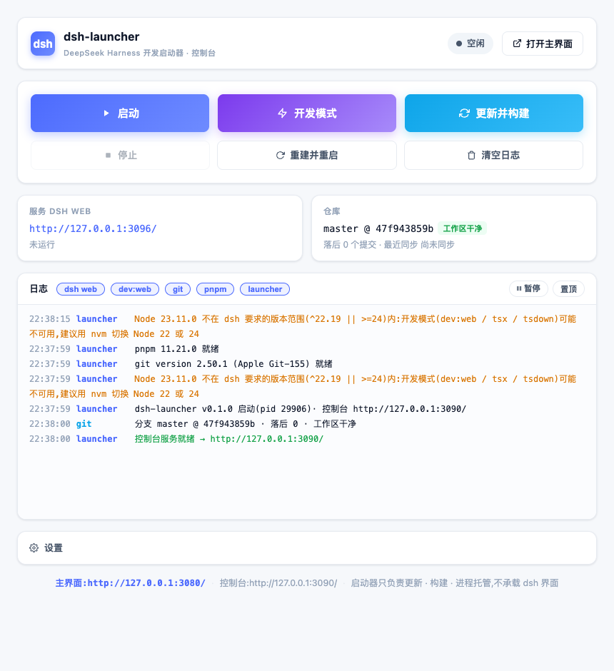
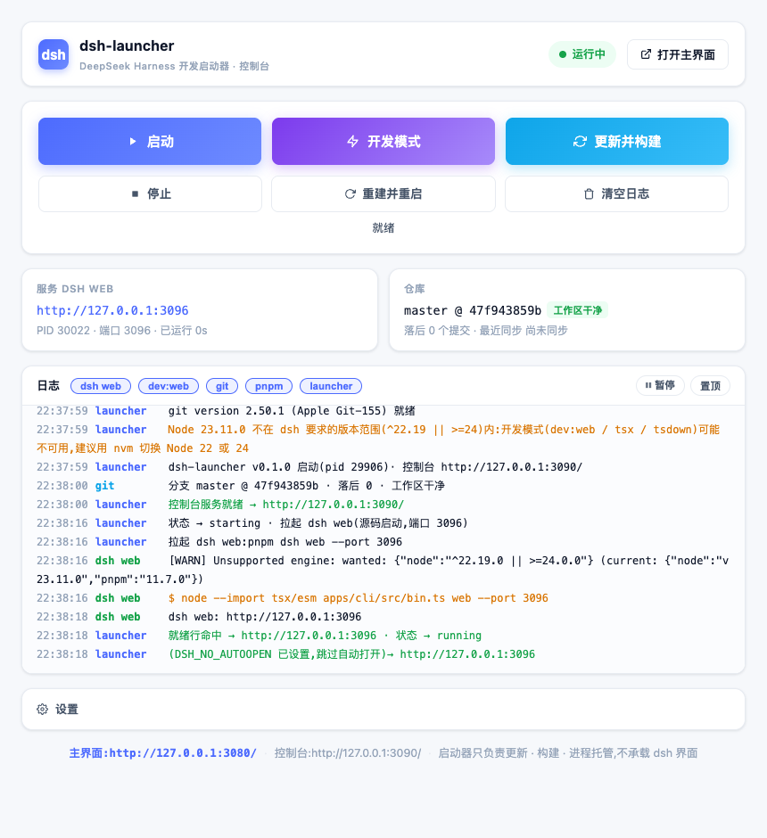
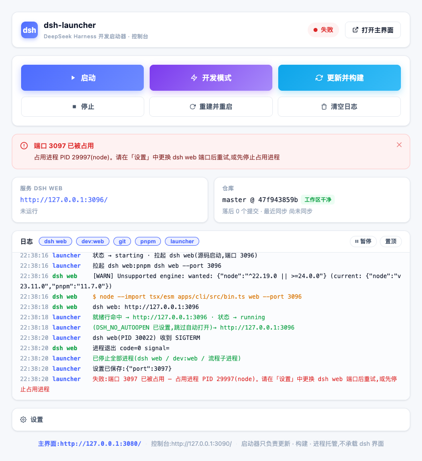

<div align="center">

# ⚡ dsh-launcher

**为 [DeepSeek Harness](https://github.com/deepseek-ai/deepseek-harness)(dsh)开发者打造的纯启动器**

源码启动 dsh web · 一键更新构建 · 热重载开发模式 · 后台常驻 · 亮色单页控制台

**零 npm 运行时依赖 —— 只用一个文件双击,其余全靠 Node 内置模块**

</div>

---

## 🖼️ 长什么样

双击 `start.command`,浏览器打开亮色控制台:

| 空闲 | 运行中(就绪后自动打开主界面) | 失败(明确诊断,不闪退) |
|---|---|---|
|  |  |  |

> 定位铁律:**启动器只是一个启动器**。它不承载任何 dsh 界面——主界面永远是 `http://127.0.0.1:3080/`(dsh web),启动器只负责把它拉起来、托管进程、提供控制与日志。

## ✨ 功能

| 操作 | 说明 |
|---|---|
| **启动** | 源码启动 `pnpm dsh web`(等价 `node --import tsx/esm apps/cli/src/bin.ts web`),**不用 npx、不装发布包**;就绪行命中 → 自动打开主界面 |
| **开发模式** | 同跑 `dsh web` + `pnpm run dev:web`(HMR watcher);客户端插件/前端改动**免刷新热更**,`lib/` 产物改动点「重建并重启」 |
| **更新并构建** | `git fetch` → 自动 stash → `git pull --rebase --autostash`(冲突**只报告、绝不 reset --hard**)→ lockfile 变化才 `pnpm install` → 阶段化构建 → 重启服务 |
| **停止 / 重建并重启** | 进程组 SIGTERM → 5s → SIGKILL,零残留;重建保持原模式 |
| **后台常驻** | 关掉浏览器/控制台不影响服务;launcher 重启后自动**召回**运行中的 dsh web;重复双击只召回,不重复起 |
| **日志** | 控制台按来源(dsh web / dev:web / git / pnpm / launcher)着色、实时 SSE 推送;同时落盘 `~/.local/state/dsh-launcher/logs/` 可回溯 |
| **设置** | 仓库路径、端口、host、`DSH_HOME`、构建参数透传、开机自启(LaunchAgent) |

## 🚀 快速开始(macOS)

```sh
git clone https://github.com/Yoahoug/dsh-launcher.git
chmod +x dsh-launcher/bin/start.command    # 若权限未保留
```

**双击 `bin/start.command`** → 控制台 `http://127.0.0.1:3090/` 自动打开(<0.5s)。点「启动」→ dsh web 就绪并自动打开主界面。

### 使用提示

- dsh web 启动需前端 dist 已构建——首次请先点「**更新并构建**」。
- 端口被占用(如 3080 已有实例)时会给出占用进程 PID 与换端口建议,改完设置重试即可。
- 开发模式需要 Node `^22.19 || >=24`(本机 23 时控制台会明确提示;`dev:web` 的 tsx/tsdown 与 Node 23 不兼容)。

## 🗂️ 结构

```
bin/start.command       双击入口(起服务 → 开控制台;二次双击只召回)
src/server.mjs          HTTP 服务 + SSE + 动作编排(状态机)
src/process.mjs         进程托管 / 就绪检测 / 进程组停止
src/repo.mjs            git 同步(冲突只报告)
src/build.mjs           lockfile 比对 + 阶段化构建
src/log.mjs             环形日志 + 落盘 + 广播
public/                 亮色单页控制台(纯 HTML/CSS/JS)
scripts/                LaunchAgent 开机自启安装/卸载
```

## 📚 文档

- 完整开发方案:[`doc/DEVELOPMENT-PLAN.md`](doc/DEVELOPMENT-PLAN.md)(需求、架构、里程碑、验收)
- UI 原型:[`doc/ui/mockup.html`](doc/ui/mockup.html)(浏览器直接打开预览)

## 📄 License

[MIT](LICENSE)
